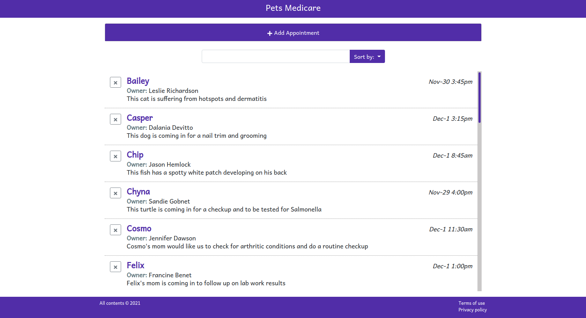

# Pets' Medicare

> This is a simple appointment manager for Pets Medicare(a fictional company). A user can create an appointment, delete an appointment, search the available appointments, and sort them.

## Built With

- JavaScript
- React
- Bootstrap
- React Icons
- React Moment

## Live Demo

[Live Demo Link](https://objective-bose-5b5ea0.netlify.app/)

## Getting Started

To get a local copy up and running follow these simple example steps.

To get a local copy up and running follow these simple example steps.
- `git@github.com:trekab/appointments-manager.git`

Then you browse to the folder and exucute the following commands
- `cd appointments-manager`
- run `npm install`
- run `npm run start` to have the app open up in your default browser.

## Authors

👤 **Treasure Kabareebe**

- Github: [@trekab](https://github.com/trekab)
- Twitter: [@TKabareebe](https://twitter.com/TKabareebe)
- Linkedin: [Treasure Kabareebe](https://www.linkedin.com/in/treasure-kabareebe/)

## 🤝 Contributing

Contributions, issues and feature requests are welcome!

Feel free to check the [issues page](issues/).

## Show your support

Give a ⭐️ if you like this project!

## Acknowledgments

- [LinkedIn](https://www.linkedin.com/learning/react-js-building-an-interface-2/creating-interfaces-with-react)

## 📝 License

This project is [MIT](lic.url) licensed.
